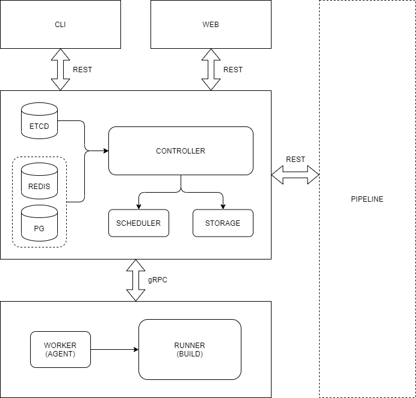

# manifest

## Introduction

*distbuild* is a distributed build service written in Rust.


## Run

```bash
./clone.sh
```


## Design




## License

Project License can be found [here](LICENSE).


## Reference

- [buildbarn](https://github.com/buildbarn/bb-deployments)
- [git-repo](https://gerrit.googlesource.com/git-repo/)
- [goma](https://chromium.googlesource.com/infra/goma/)
- [ninja](https://github.com/ninja-build/ninja)
